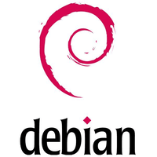
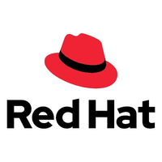

# Linux Basics: The Backbone of Global Infrastructure 🐧

Linux is the undisputed heavyweight champion of the computing world. It is highly adaptable, hardware-agnostic, and forms the core foundation of modern software engineering. 

## Why Linux Rules the Server-Side World
While Windows dominates personal desktops, Linux is the absolute standard for enterprise infrastructure. It is the definition of stability, speed, and security.

* **Cloud Computing & Deployments:** Almost all modern deployment technologies (Docker containers, Kubernetes clusters, AWS EC2 instances) are built natively on Linux.
* **Supercomputers:** Literally 100% of the world's top 500 supercomputers run on Linux due to its ability to be heavily customized for performance.
* **The Internet:** The majority of web servers (Apache, Nginx) keeping the internet alive run on Linux.
* **High-Frequency Finance:** Global financial trades rely on Linux because of its unmatched low-latency speed and security.
* **Mobile & IoT:** It powers billions of Android devices globally and runs everything from smart TVs to spacecraft.

## The Anatomy of a Linux System
An Operating System isn't just one block of code; it is a stack of distinct layers working together. 

* **Hardware Layer:** The physical CPU, RAM, and disk drives.
* **The Kernel:** The core "brain" of the OS. It talks directly to the physical hardware and manages memory, processes, and device drivers.
* **Boot Loader:** The initial program (like GRUB) that runs when the server powers on. Its only job is to load the Kernel into memory.
* **System Libraries / GNU Utilities:** The core tools that allow software to communicate with the Kernel without needing to understand raw hardware code.
* **User Space & Shell:** The terminal environment where users type commands to interact with the system.

> ⚠️ **The "Headless" Server Concept:** 
> In consumer Linux, the top layer is the **Desktop Environment (DE)** (like GNOME or KDE Plasma), which provides a GUI. However, in backend engineering and cloud deployments, servers run **Headless**—meaning there is no GUI at all. You interact with them strictly through the terminal to save memory and CPU resources!

---

## The GNU/Linux Distinction
A functioning operating system is fundamentally divided into two distinct parts: the hardware communicator and the user-facing tools.

**The Linux Kernel**
Created by Linus Torvalds in 1991, the kernel is the engine that talks directly to the physical hardware (CPU, RAM, disk). However, a kernel on its own is completely unusable by a human. It has no terminal, no login screen, no text editor, and no commands.

**GNU (GNU's Not Unix!)**
Started by Richard Stallman in 1983, this is a massive collection of free, open-source user-space programs. When you use the `bash` terminal, compile C code with `gcc`, or type commands like `ls`, `cp`, and `mv` (known as the GNU Coreutils), you are using GNU tools, not Linux tools! It also includes `glibc`, the critical C library that acts as the bridge allowing software to actually communicate with the Linux kernel.

**The Historic Combination**
In the early 90s, the GNU project had built a massive ecosystem of tools but lacked a working kernel. Linus Torvalds had built a brilliant kernel but had no tools to run on it. Combined, they formed the complete "GNU/Linux" operating systems that power the internet today.

## Can you have Linux WITHOUT GNU?
Yes! Because the Linux architecture is strictly modular, developers can completely swap out the massive GNU tools for lighter alternatives when building highly specialized systems.

**Android (Mobile OS)**
Your smartphone runs the Linux Kernel! However, Google did not want to use the heavy GNU toolset. Instead, they built their own custom user-space utilities (like Bionic for their C library and Toybox for terminal commands) and run a virtual machine on top. Therefore, Android is Linux, but it is strictly NOT GNU/Linux.

**Alpine Linux (Cloud & Docker Standard)**
This is a famous, ultra-lightweight distribution used heavily by backend engineers for Docker containers and microservices. To keep the base operating system file size under an incredibly tiny 5MB, developers stripped out GNU entirely. They replaced it with a minimalist toolkit called **BusyBox** and a lighter C library called `musl`.

**Embedded Systems (IoT Devices)**
If your home Wi-Fi router, Smart TV, or smart fridge is running Linux, it cannot afford the storage space required by the massive GNU coreutils. These devices almost exclusively rely on BusyBox. Known as the "Swiss Army Knife of Embedded Linux," BusyBox bundles hundreds of stripped-down terminal commands into one single, tiny executable file!

---

##  What is a "Distribution" (Distro)?
The Linux Kernel is just the engine; you need to build a car around it to make it drivable. A **Distro** is the Linux Kernel bundled together with a specific set of tools, making it a ready-to-use OS.

A complete enterprise Distro includes:
* Compilers (GCC, Clang) for building software.
* Package Managers (e.g., `apt`, `dnf`) to automate installing and updating software.
* Init Systems (like `systemd`) to manage background services.

## The Major Linux Families
While there are thousands of distros, the enterprise and server-side world is dominated by a few main architectural families, largely defined by the **Package Manager** they use.

### The Debian Family 

Known for massive community support and user-friendliness. Ubuntu is the most popular server OS in the world for startups and cloud deployments.
* **Key Enterprise/Server:** 
    * Ubuntu Server
    * Debian
* **Desktop/Security:** 
    * Linux Mint
    * Pop!_OS
    * Kali Linux
    * Parrot OS
* **Others:** 
    * elementary OS
    * Zorin OS
    * MX Linux
    * Devuan
    * Peppermint OS
    * antiX
    * Bodhi Linux
    * Deepin
    * PureOS
    * Raspberry Pi OS
    * Lubuntu
    * Kubuntu
    * Xubuntu
    * Ubuntu MATE
    * Ubuntu Budgie
    * KDE neon

- **Package Manager:**

| High-Level Manager (Internet) | Low-Level Manager (Offline) | Native Package File |
| :--- | :--- | :--- |
| **APT** (Advanced Package Tool) | `dpkg` | `.deb` |

### The Red Hat Family 

The absolute gold standard for corporate enterprise environments. Built for extreme stability, strict security (SELinux), and long-term support.
* **Key Enterprise/Server:** 
    * Red Hat Enterprise Linux (RHEL)
    * AlmaLinux
    * Rocky Linux
    * Oracle Linux.
* **Desktop/Development:** 
    * Fedora (Cutting-edge upstream for RHEL)
    * CentOS Stream.
* **Others:** 
    * EuroLinux
    * Scientific Linux
    * ClearOS
    * Amazon Linux (AWS standard).

- **Package Manager:**

| High-Level Manager (Internet) | Low-Level Manager (Offline) | Native Package File |
| :--- | :--- | :--- |
| **DNF** (Dandified YUM) | `rpm` | `.rpm` |

### The SUSE Family 

Massively popular in European enterprise environments and enterprise resource planning (like SAP hosting).
* **Key Distros:** 
    * SUSE Linux Enterprise (SLE)
    * openSUSE Leap
    * openSUSE Tumbleweed
    * GeckoLinux
    * Regata OS.

- **Package Manager:**

| High-Level Manager (Internet) | Low-Level Manager (Offline) | Native Package File |
| :--- | :--- | :--- |
| `zypper` | `rpm` | `.rpm` |

### Other Major Architectures
* **Arch Family (`pacman`):** Rolling release distros built for power users who want the absolute newest software updates immediately. ).
    * Arch Linux
    * Manjaro
    * EndeavourOS
    * Garuda Linux
    * ArcoLinux
    * CachyOS
* **Gentoo Family (`portage`):** Source-based distros where every piece of software is compiled directly on your machine for maximum hardware optimization. 
    * Gentoo
    * Calculate Linux
    * Redcore Linux
    * Funtoo
* **Slackware Family:** The oldest surviving Linux family, known for UNIX-like simplicity.
    * Slackware
    * Salix OS
    * Zenwalk
* **Independent / Specialized:** 
    * Alpine Linux (Massively used in Docker containers because it is incredibly tiny)
    * NixOS
    * Void Linux
    * Solus
    * Tiny Core Linux
    * Puppy Linux
    * KaOS
    * Chimera Linux
    * CRUX
    * Bedrock Linux
