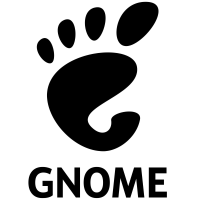
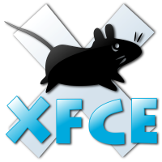

# The Linux Graphical Stack (GUI Architecture) 

Unlike Windows or macOS, where the graphical interface is deeply integrated into the operating system kernel, Linux strictly decouples the OS kernel from the visual layer. The GUI is simply a collection of modular user-space software running on top of the base system. 

Because it is modular, you can rip out the entire GUI, replace it, or run without one entirely (Headless), and the core operating system will not care.

---

## The Graphical Boot Sequence
When a Linux machine powers on and aims for a visual desktop, it follows a strict chain of command:
1. `systemd` (PID 1) reaches the `graphical.target`.
2. It launches a **Display Manager** (the login screen).
3. The Display Manager starts the **Display Server** (the rendering engine).
4. Upon entering your password, it hands control to the **Desktop Environment** or **Window Manager**.

### Emergency SysAdmin Commands
If your system boots into a pure text terminal (TTY) because the graphical stack failed to load, you can manually intervene:
```bash
# Force the GNOME Display Manager to start (Ubuntu/Debian)
$ sudo systemctl start gdm3

# The Legacy Fallback: Forcefully bypass the Display Manager and start a raw X11 session
$ startx
```

## Display Servers (The Rendering Protocol)
The Display Server is the lowest-level graphics engine. It communicates directly with the Linux kernel (specifically the DRM - Direct Rendering Manager) and the hardware (GPU, mouse, keyboard) to physically draw pixels on the screen.

### X11 (Xorg) - The Legacy Standard
Created in the 1980s, X11 is actually a network protocol.
* **How it works:** Applications are "clients" that send drawing instructions over a local network socket to the X11 "server".
* **The Flaw:** Because it was built before modern security existed, it is inherently insecure. Any application running on X11 can theoretically read the keystrokes or screen contents of any other application (making it vulnerable to keyloggers).

### Wayland - The Modern Standard
Wayland is the secure, modern replacement. It is the default on modern Ubuntu, Fedora, and RHEL.
* **How it works:** Wayland acts as a "compositor." Applications render their own windows independently, and Wayland securely stitches them together on the screen.
* **The Advantage:** It provides tear-free rendering and strict security isolation. An app cannot spy on another app without explicit permission from the user.
* **XWayland:** A built-in compatibility layer. If you run a legacy app coded strictly for X11, XWayland seamlessly translates the instructions so the app runs flawlessly on a Wayland session!

## Desktop Environments vs. Window Managers
### The Desktop Environment (DE) - The Complete Suite

Think of the Linux OS like the core Android engine. The DEs are the custom software "skins" on top:
* Samsung uses One UI
* Google Pixel uses Stock Android
* Oppo uses ColorOS

**Result:** They all run the exact same Android apps, but the buttons, menus, and overall style look completely different!

A DE is a massive, coordinated collection of software. It provides the window manager, taskbar, system settings, lock screen, and default apps. They are usually built on two main graphical toolkits: GTK or Qt.

#### Industry Standard DEs:
**GNOME (GTK):** 



The modern, minimalist standard. Utilizes an "Activities" overview instead of a traditional taskbar. Highly keyboard-driven.
* *Default on:* 
    * Ubuntu
    * Fedora
    * Debian
    * Red Hat Enterprise Linux (RHEL).
* *Customized variants:* 
    * Pop!_OS (tailored heavily for developers).

**KDE Plasma (Qt):** 


Provides a traditional paradigm (Start menu, taskbar) but offers unparalleled, pixel-level customization. It is famously resource-efficient now. 
* *Default on:* 
    * Kubuntu
    * SteamOS (used on the Steam Deck)
    * openSUSE
    * Manjaro KDE.

**Cinnamon (GTK):** 


A robust, traditional DE built specifically by Linux Mint to make the transition from Windows to Linux completely seamless.
* *Default on:* Linux Mint.

**XFCE (GTK):** 



An ultra-lightweight, resource-efficient DE designed for older hardware or minimal server environments.

### The Window Manager (WM) - The Hacker's Choice
Power users and developers often ditch the heavy Desktop Environment entirely and use only a Window Manager.

* **Tiling WMs (i3, Sway, bspwm):** Instead of floating windows that you drag around with a mouse, Tiling WMs automatically arrange your windows into a perfect, mathematically divided grid.
* **The Vibe:** It is entirely keyboard-driven. You rarely touch your mouse. It uses virtually zero RAM (often under 200MB on boot) and maximizes screen real estate for coding and terminal multiplexing.

## Display Managers (The Bouncer)
The Display Manager (DM) is a background daemon whose primary job is to manage user authentication. It presents the graphical login screen, verifies your credentials, and lets you choose which DE or WM you want to log into.
* GDM3 (GNOME Display Manager): The standard for GNOME systems.
* SDDM (Simple Desktop Display Manager): The highly themeable standard for KDE Plasma.
* LightDM: A highly customizable, lightweight alternative frequently paired with XFCE or Cinnamon.

## GUI File Management & The XDG Standard 
Every Desktop Environment bundles its own official graphical file manager to navigate the filesystem.
* GNOME: Uses `Files` (Executable name: `nautilus`).
* KDE Plasma: Uses `Dolphin` (Highly advanced, split-pane capable).
* Cinnamon: Uses `Nemo`
* XFCE: Uses `Thunar`.

### Directory Integration & Hidden Configs
When launched, the file manager defaults to your isolated `/home/username` directory. The OS automatically populates this using the XDG Base Directory Specification.

As a backend developer, you must know where Linux hides your application data inside your home folder (press `Ctrl + H` in your file manager to see them!):
* **`~/.config/`:** Where all your user-specific application configurations are stored (e.g., VS Code settings, Discord configs).
* **`~/.local/share/`:** Where user-specific application data is stored (like downloaded Flatpak apps or local databases).
* **`~/.cache/`:** Where apps store temporary data to speed up loading times.
