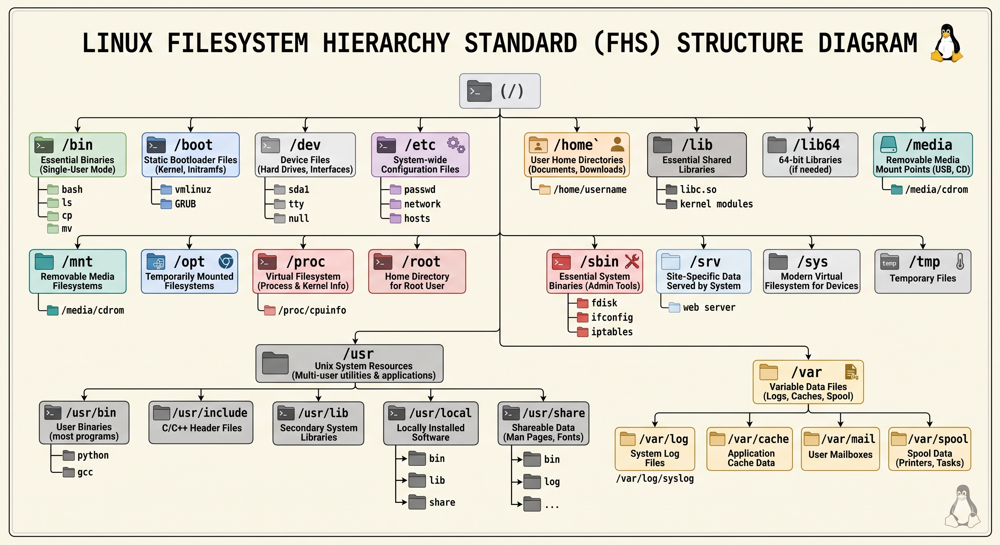

# The Linux Filesystem Hierarchy Standard (FHS) 🗂️

## The Core Philosophy
* **The Root Directory (`/`):** The absolute starting point of the entire operating system. It acts as the trunk of the filesystem tree. Every single folder, application, and attached physical hard drive branches out from this single slash.
* **"Everything is a File":** A defining concept of Linux. Text documents, hard drives, keyboards, network sockets, and active system processes are all treated as "files." This allows you to use the exact same commands (`cat`, `echo`, `chmod`) to interact with a text file as you would a physical USB port!
* **Absolute vs. Relative Paths:** Because everything starts at Root, an *Absolute Path* always starts with `/` (e.g., `/var/log/syslog`), tracing the exact route from the trunk. A *Relative Path* starts from wherever you currently are in the terminal (e.g., `./syslog`).

## What is the FHS?
The **Filesystem Hierarchy Standard (FHS)** (currently FHS 3.0) is the universal, industry-wide specification that defines the directory structure in Linux distributions. 
* **The Big Benefit (Predictability):** Because of the FHS, if you learn how to locate configuration files on an Ubuntu system, you automatically know exactly where they are on Fedora, Debian, or Arch.

---

## The Master Directory Breakdown

### 👤 User and Administrator Workspaces
User isolation is a core security feature of Linux. These directories separate standard user data from the core operating system, ensuring that a regular user downloading a massive file or executing a bad script cannot crash the server.

| Directory | What it is (Technical Function) | Industry Examples / Tips | Windows Equivalent |
| :--- | :--- | :--- | :--- |
| **`/home`** | Personal directories for standard users to store documents, downloads, and user-specific configurations (like `.bashrc`). | **Shortcut:** Typing `cd ~` transports you here instantly. | `C:\Users\` |
| **`/root`** | The strictly private, isolated home folder specifically reserved for the *Superuser* (Admin). It is separated from `/home` for emergency recoveries. | `/root/.ssh/` | `C:\Users\Administrator` |
| **`/etc/skel`** | **(Extra)** The "Skeleton" directory. When you create a brand new user, Linux copies all default hidden files from here into their new `/home` folder! | `/etc/skel/.profile` | `C:\Users\Default` |

### System Binaries & The Modern "usrMerge"
Historically, UNIX physically separated the bare essentials (`/bin`) from general software (`/usr/bin`) due to the small storage sizes of early hard drives. Today, modern distros (Ubuntu, Fedora, Arch) use the **usrMerge**. Physical space is no longer an issue, so all core binaries are moved into `/usr`. The root-level folders are now just **symbolic links** (shortcuts) pointing directly into `/usr`!

| Directory | What it is (Technical Function) | Industry Examples / Tips | Windows Equivalent |
| :--- | :--- | :--- | :--- |
| **`/usr`** | **U**niversal **S**ystem **R**esources. The massive primary software library containing the bulk of the OS. | N/A | `C:\Program Files` & `C:\Windows` |
| **`/bin`** | Essential, everyday binary executables (commands) available to all users. | `ls`, `cat`, `mkdir`, `cp` | `System32` (Commands) |
| **`/sbin`** | System binaries (admin tools) generally requiring `root`/`sudo` privileges to execute. | `fdisk`, `iptables`, `reboot` | `System32` (Admin Tools) |
| **`/lib`** | Shared library files (`.so` files) required by the programs running in `bin` and `sbin` so they don't duplicate code. | `libc.so.6` | `.dll` files |
| **`/usr/local`** | The DIY Directory! If you manually compile software from source code instead of using `apt`/`dnf`, it goes here to prevent conflicts. | `/usr/local/bin` | Custom `C:\` Installs |
| **`/usr/share`** | **(Extra)** Architecture-independent data used by programs, like icons, fonts, dictionaries, and `man` pages. | `/usr/share/fonts` | `C:\Windows\Fonts` |

### Configuration and State Management
This is the central nervous system of your server. These directories manage how the system boots, who has access, and track everything that happens while the server is actively running.

| Directory | What it is (Technical Function) | Industry Examples / Tips | Windows Equivalent |
| :--- | :--- | :--- | :--- |
| **`/etc`** | The central hub for global system configurations. Almost everything here is a plain text file you can edit with `nano` or `vim`. | `/etc/passwd`, `/etc/fstab` | The Registry |
| **`/var`** | Variable data. Unlike `/usr` (which is static), files here are constantly changing, growing, and adapting while the system runs. | `/var/www/html` (Web files) | `C:\ProgramData` |
| **`/var/log`** | **(Extra)** The master log directory. If an application crashes, or a hacker tries to SSH into your server, it is logged here. | `/var/log/syslog` | Event Viewer Logs |
| **`/var/cache`** | **(Extra)** Cached data from applications (like the `apt` package manager storing downloaded `.deb` files). | `/var/cache/apt/` | `AppData` Caches |
| **`/var/spool`** | **(Extra)** Queued tasks waiting to be processed, like print jobs or scheduled `cron` jobs. | `/var/spool/cron` | `C:\Windows\System32\spool` |

### Virtual Filesystems and Hardware
These directories don't physically exist on your hard drive! They are virtual filesystems created entirely in the system's RAM by the Linux Kernel to give you a text-based interface to interact with hardware.

| Directory | What it is (Technical Function) | Industry Examples / Tips | Windows Equivalent |
| :--- | :--- | :--- | :--- |
| **`/dev`** | Device files. Physical hardware components are interacted with as if they were files. | `/dev/sda1` (Hard drive) | Device Manager |
| **`/dev/null`** | **(Extra)** The Black Hole. Any output routed here is instantly deleted forever. Used to silence script errors. | `2> /dev/null` | *None* |
| **`/proc`** | A RAM-based virtual filesystem reporting live data about active process IDs and kernel status. | `/proc/cpuinfo` | Task Manager |
| **`/sys`** | A modern virtual filesystem linking directly to hardware devices. Sysadmins use it to control power states and CPUs. | `/sys/class/net/` | Device Manager Properties |
| **`/run`** | **(Extra)** Ephemeral runtime data (PIDs, lock files) generated since the machine was turned on. | `/run/systemd/` | *None (Kept in RAM)* |

### Mounting, External Storage & Recovery
Because Linux doesn't use Drive Letters (`D:` or `E:`), external storage and secondary hard drives must be physically "mounted" (attached) to specific folders in the filesystem to be accessed.

| Directory | What it is (Technical Function) | Industry Examples / Tips | Windows Equivalent |
| :--- | :--- | :--- | :--- |
| **`/media`** | Automated mounts. Modern Desktop Environments automatically mount USBs or DVDs dynamically here. | `/media/student/USB_DRIVE` | `D:\` or `E:\` Drive |
| **`/mnt`** | Manual mounts. The traditional directory used by SysAdmins to attach massive Cloud Block Storage volumes. | `/mnt/database_backup` | NTFS Mount Points |
| **`/lost+found`** | The Recovery Room. If a sudden power outage corrupts a drive, the `fsck` tool dumps recovered file fragments here! | Created on every `ext4` drive | `found.000` (Chkdsk) |

### Bootloader, Temp, & Third-Party
The final critical pieces of the puzzle, holding everything from the initial boot sequence to massive third-party proprietary applications.

| Directory | What it is (Technical Function) | Industry Examples / Tips | Windows Equivalent |
| :--- | :--- | :--- | :--- |
| **`/boot`** | The absolute minimum static files required to start the OS before the filesystem loads (Kernel `vmlinuz`, GRUB). | `/boot/grub/grub.cfg` | EFI System Partition / `C:\Boot` |
| **`/tmp`** | A scratchpad for applications to store temporary data. **Warning:** Usually wiped completely clean on reboot! | Temporary session caches | `C:\Windows\Temp\` |
| **`/opt`** | **Opt**ional Software. Where massive standalone third-party apps (Docker, Chrome) install to avoid cluttering `/usr`. | `/opt/google/chrome` | `C:\Program Files` |
| **`/srv`** | **Srv**ice Data. If your machine acts as a web/FTP server, the data actively served to the world is traditionally placed here. | `/srv/ftp/` | `C:\inetpub\wwwroot` |