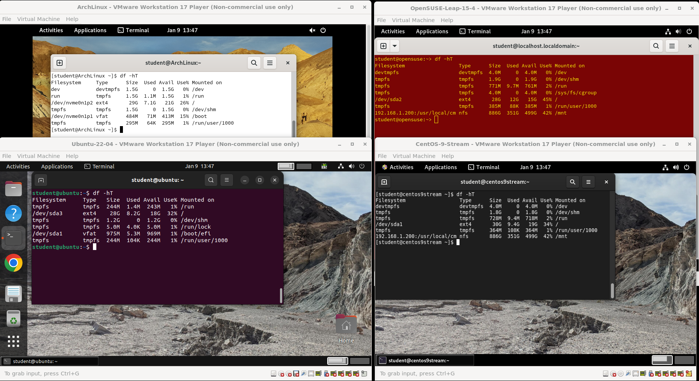
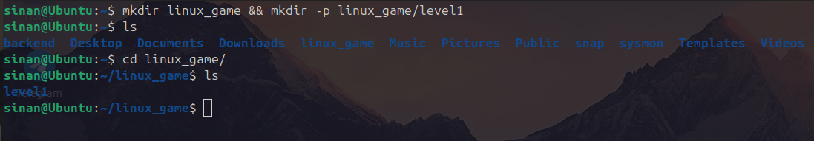
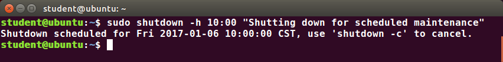
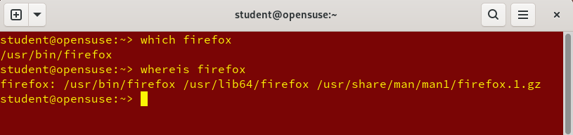
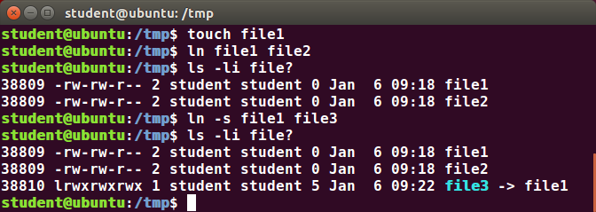
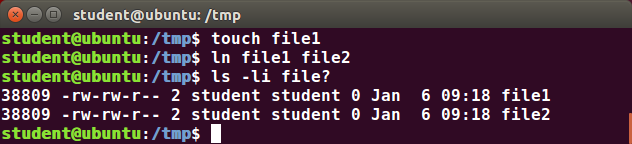
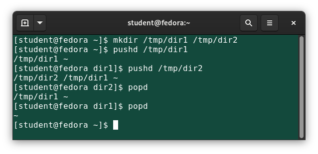

# Basic Command Line Mastery & File Operations

The Command Line Interface (CLI) is the primary way backend engineers and system administrators interact with Linux. While Graphical User Interfaces (GUIs) are convenient, the CLI offers unmatched speed, automation capabilities, and granular control over the system.

## Terminal vs. Shell: Understanding the Environment
People often use these terms interchangeably, but they are two completely different pieces of software:

* **The Shell:** This is the actual engine running inside the terminal. It is a command interpreter that takes the text you type, translates it into system calls for the Linux Kernel, and returns the result. (Examples: `bash`, `zsh`, `fish`).
* **The Terminal Emulator (The GUI Bridge):** A "Terminal Emulator" is not the shell itself; it is simply a graphical program (a window) that runs on your desktop environment. It simulates a pure, text-only console, allowing you to interact with the underlying shell without leaving your GUI.



### Industry Context
When managing remote AWS or Azure servers, the remote server rarely has a GUI installed to save RAM (Headless). You use your local terminal emulator to open a secure connection (SSH) to that remote machine.

### Popular Emulators
* `gnome-terminal`: The standard default for GNOME-based distros (like Ubuntu).
* `konsole`: The highly customizable default for KDE environments.
* `xterm`: The ancient, bare-bones classic. Very lightweight but lacks modern features.
* `terminator` / `tmux`: The industry favorites for power users. They allow you to tile and split your single window into multiple grid panes, so you can monitor server logs in one pane while editing code in another.

### Operating System CLI Comparison

| Feature | Linux / Unix | Windows |
| :--- | :--- | :--- |
| **Default Shell** | **Bash** (Bourne Again SHell) or **Zsh** | **Command Prompt** (`cmd.exe`) or **PowerShell** |
| **Path Separator** | Forward slash `/` (e.g., `/var/log`) | Backslash `\` (e.g., `C:\Windows`) |
| **Case Sensitivity** | **Strict** (`File.txt` $\neq$ `file.txt`) | **Loose** (`File.txt` = `file.txt`) |
| **Elevation** | `sudo` (SuperUser Do) | "Run as Administrator" |

---
## Anatomy of a Linux Command
Every command you type into the terminal follows a strict structural syntax. Understanding this structure is the key to reading and writing complex server administration scripts. It is usually broken down into three distinct parts, separated by spaces: 

`Command [Options] [Arguments]`

* **1. The Command (The Action):** 
  The actual name of the executable binary program or script you want to run. 
  *(Example: `ls`, `cp`, `rm`)*
* **2. The Options / Switches (The Modifiers):** 
  Settings that tweak how the command behaves.
  * **Short Flags:** Usually a single dash followed by a letter (`-l` for long format, `-a` for all/hidden files). Short flags can usually be combined together (`-la`).
  * **Long Flags:** Usually a double dash followed by a full word (`--help`, `--version`).
* **3. The Arguments (The Targets):** 
  The specific target the command operates on. This is usually a file name, a directory path, or a specific string of text.
  *(Example: `/var/log/syslog`)*

### 💻 Code Implementation Example:
```bash
# Breaking down: ls -la /etc

# Command:  ls   (List the files)
# Options:  -la  (Modify the output to use a 'long' list format AND show 'all' hidden files)
# Argument: /etc (The specific target directory to perform this action on)

$ ls -la /etc
```

---

## Navigation & Directory Management

Before manipulating files, you must know how to move around the filesystem. Linux relies heavily on **Absolute Paths** (starting from the root `/`) and **Relative Paths** (starting from your current location).

* **`pwd` (Print Working Directory)**
    * Displays your exact current location in the filesystem. Always run this if you are lost!
* **`cd` (Change Directory)**
    * `cd /var/www` → Moves to an absolute path.
    * `cd Documents` → Moves into a folder within your current directory.
    * `cd ..` → Moves up one level to the parent directory.
    * `cd ~` → Instantly returns you to your user's Home directory.
    * `cd -` → Jumps back to the previous directory you were just in.
* **`ls` (List)**
    * `ls` → Basic list of files and folders.
    * `ls -l` → Long format (shows permissions, owner, size, and modification date).
    * `ls -a` → Shows hidden files (any file starting with a dot, like `.bashrc`).
    * `ls -lah` → The holy grail combo: long format, all files, human-readable sizes (e.g., 1K, 234M, 2G).
* **`mkdir` (Make Directory)**
    * `mkdir project` → Creates a single folder.
    * `mkdir -p backend/src/api` → Creates the target directory *and* any missing parent directories along the way.
  

---

## File Creation & Manipulation

### `touch` → Create Empty Files
Updates the timestamp of an existing file, or creates a brand new empty file if it doesn't exist.
```bash
touch index.html config.json
```
`cp` → Copying Files and Directories
Used to duplicate files or directories. By default, copying overwrites existing files silently.

**Copy a file:**
```Bash
cp source.txt backup.txt
```

**Copy with interactive warning (Safe Mode):**
```Bash
cp -i source.txt backup.txt
# Prompts: "cp: overwrite 'backup.txt'?"
```

**Copy a directory (Recursive):**
You must use the `-r` flag to copy a folder and everything inside it.
```Bash
cp -r /var/www/html /backup/html_backup
```

`mv` → Move or Rename
The `mv` command is unique: it is used for both moving files to new locations AND renaming them. Under the hood, moving a file within the same filesystem is incredibly fast because Linux just updates the inode pointer rather than copying the physical data.

**Rename a file:**
```Bash
mv old_name.txt new_name.txt
```

**Move files to a directory:**
```Bash
mv index.html /var/www/html/
```

`rm` → Remove (Delete) ⚠️
There is no "Recycle Bin" in the terminal. Once a file is removed using `rm`, it is gone permanently.

**Remove a file:**
```Bash
rm obsolete.txt
```

**Remove an empty directory (Safest):**
```Bash
rmdir empty_folder/
```

**Remove a directory and its contents (Recursive):**
```Bash
rm -r old_project/
```

**The "Nuclear" Option (Recursive + Force):**
```Bash
rm -rf /path/to/folder
# Deletes the folder and everything inside it immediately without asking.
# NEVER run this on root directories (/) or without double-checking your path!
```
## The Built-in Encyclopedia (`man`)
Before Googling how to use a command, system administrators rely on the built-in system manuals.
* `man` (Manual): Typing `man` before any command opens its official, deeply detailed documentation, explaining every possible option and flag.

```Bash
# Open the manual for the 'ls' command (Press 'q' to quit when done reading)
$ man ls
```

> To see the numbered list of all your past commands, just type: `history`


## The Pipe (`|`) & Command Chaining
The Pipe is the ultimate superpower of Unix-based systems. It allows you to connect multiple small, single-purpose programs together to perform massive, complex tasks.
* **How it Works:** It takes the Standard Output (stdout) of the command on the left and literally "pipes" it in as the Standard Input (stdin) for the command on the right.

### Real-World Implementation Examples:
```Bash
# Example 1: Filtering large files
# Pull the entire 5,000-line system log file, but pipe it to 'grep' to ONLY display lines containing the word "ERROR"
$ cat /var/log/syslog | grep "ERROR"

# Example 2: Managing massive outputs
# If a directory has thousands of files, 'ls -la' will scroll past your screen instantly.
# Pipe it into 'less' to make the output scrollable!
$ ls -la /etc | less
```

## Reading Files Quickly
You don't always need a text editor like `nano` or `vim` just to look at a file.

* `cat` (Concatenate) → Prints the entire contents of a file to the terminal screen at once. Best for short files.
* `less` → Opens a scrollable viewer for large files (use arrow keys, press q to quit).
* `head -n 10 file.txt` → Prints only the first 10 lines of a file.
* `tail -n 10 file.txt` → Prints only the last 10 lines (incredibly useful for reading log files).

> 💡 Pro Tip - Tab Completion:
> Never type out full file paths! Type the first few letters of a directory or file and hit `TAB`. The shell will automatically complete the name for you, preventing typos and speeding up your workflow massively.

## System Power & Session Management 

Managing a server's power state from the terminal requires `root` (superuser) privileges because a sudden shutdown can corrupt databases or kick active users offline.

### The `shutdown` Command (The Safe Way)
The preferred industry method. It safely terminates processes, prevents new user logins, and broadcasts a warning message to anyone currently connected via SSH.



* `sudo shutdown -h now`: Halts (turns off) the system immediately.
* `sudo shutdown -r now`: Restarts the system immediately.
* `sudo shutdown -r +15 "Server updating!"`: Restarts in 15 minutes and sends a broadcast message to all users.
* `sudo shutdown -c`: Cancels a pending shutdown.

> 💡 **Legacy Commands:** You might see older admins use `halt`, `poweroff`, or `reboot`. On modern Linux systems, these are actually just symbolic links that silently run `shutdown -h` or `shutdown -r` behind the scenes!

---

## Finding Applications & Binaries 

When you type a command like `python3`, how does Linux know where the actual executable file is located? It searches through specific core directories (like `/bin`, `/usr/bin`, `/sbin`).



* **`which` (The Sniper):** Finds the exact file path of the executable that will run if you type that command. It only searches directories listed in your system's `$PATH` variable.
  * *Example:* `which python3` outputs `/usr/bin/python3`.
* **`whereis` (The Detective):** A broader search tool. If `which` fails, `whereis` looks beyond the `$PATH`. It locates the binary executable, the source code (if available), and the manual (`man`) pages for the program.
  * *Example:* `whereis gcc` outputs the locations of the compiler, its libraries, and its documentation.

---

## File Linking: Hard vs. Soft (Symbolic) Links 

Links allow you to create shortcuts to files. In backend engineering, this is heavily used to link configuration files across different directories without duplicating data.

### A. Soft (Symbolic) Links (`symlinks`)



* **Command:** `ln -s /path/to/original /path/to/link`
* **How it works:** This is the exact equivalent of a Windows "Desktop Shortcut". It is a tiny, separate file that simply points to the original file's location.
* **The Catch:** If you delete or move the original file, the symlink breaks and becomes a "dangling link" (usually flashing red in your terminal).

### B. Hard Links



* **Command:** `ln /path/to/original /path/to/link` (Notice the lack of `-s`)
* **How it works:** Hard links share the exact same **Inode number** as the original file. They are not shortcuts; they are literally a second door to the exact same data on the hard drive. 
* **The Magic:** Because they point directly to the data (not the file name), you can completely delete the original file, and the data will still exist perfectly intact through the hard link!

### Hard Links vs. Soft Links Cheat Sheet

| Feature | Soft Link (`symlink`) | Hard Link |
| :--- | :--- | :--- |
| **Command** | `ln -s target link_name` | `ln target link_name` |
| **Inode Number** | Different from the original | Identical to the original |
| **Cross-Partition?** | ✅ Yes (Can link from `C:` to `D:`) | ❌ No (Must be on the exact same drive) |
| **Link to Directories?** | ✅ Yes | ❌ No (Files only) |
| **If Original is Deleted?** | Link breaks (Dangling) | Data survives! (Link acts as original) |


## Advanced Directory Navigation (The Directory Stack) 

While `cd` (Change Directory) is the standard way to navigate, it is inefficient if you need to temporarily jump to a deep configuration folder and then instantly return to your project workspace. For this, SysAdmins use the **Directory Stack**.

Think of the directory stack exactly like a "Stack" data structure in C programming (LIFO - Last In, First Out).



* **`pushd [directory]` (Push Directory):** Saves your *current* location into memory (the stack) and then instantly teleports you to the new directory.
* **`popd` (Pop Directory):** Removes the top location from memory and instantly teleports you back to it. 
* **`dirs -v`:** Displays the numbered list of all the directories currently saved in your stack.

### Real-World Backend Workflow Example
Imagine you are coding your C project in `/home/student/bca-projects/c-atm-simulator/` and suddenly need to check a system log in `/var/log/nginx/`. 

1. **Jump and Save:** 
   `pushd /var/log/nginx/` 
   *(You are now in the log folder, but your C project folder is saved in memory!)*
2. **Do your work:** 
   `cat error.log`
3. **Instantly Return:** 
   `popd` 
   *(Boom! You are instantly teleported back to `/home/student/bca-projects/c-atm-simulator/` without having to type that massive path again!)*
