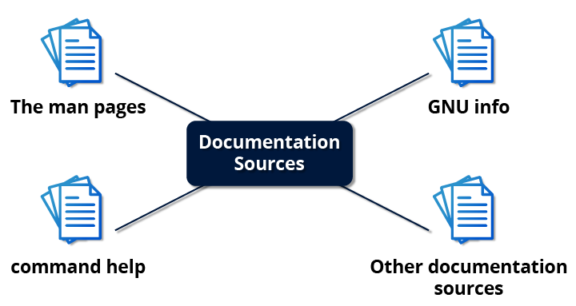
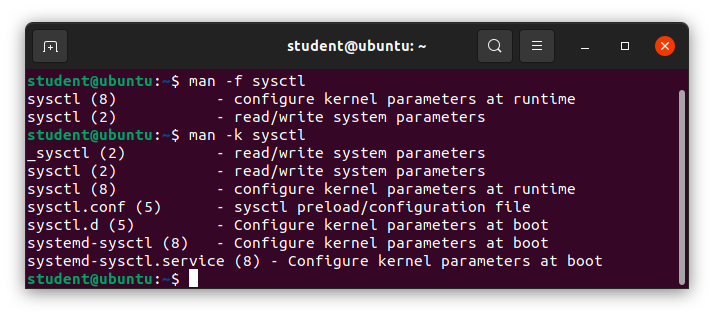
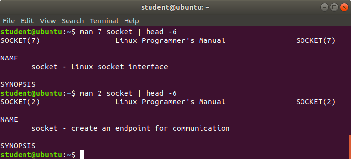
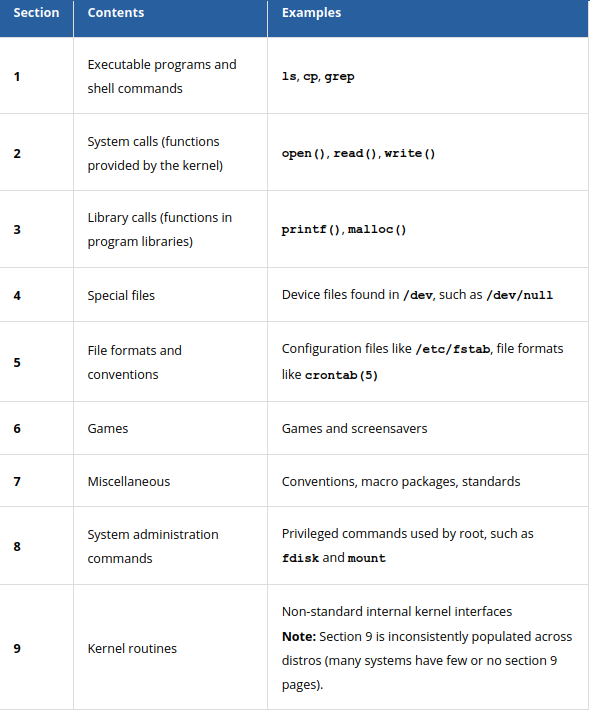
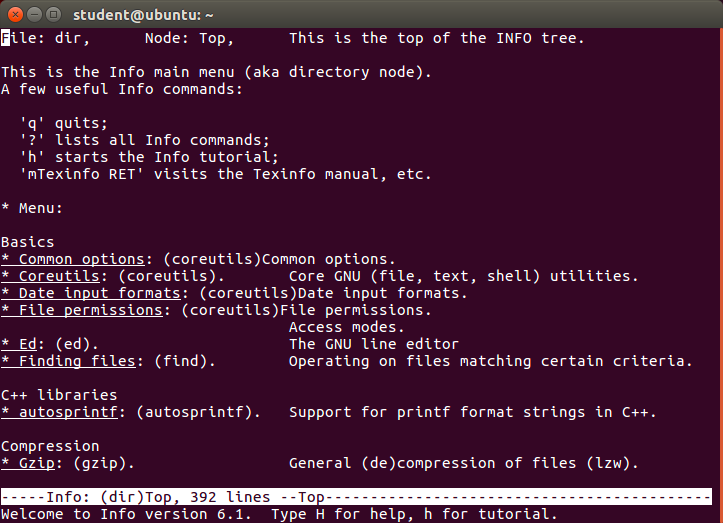
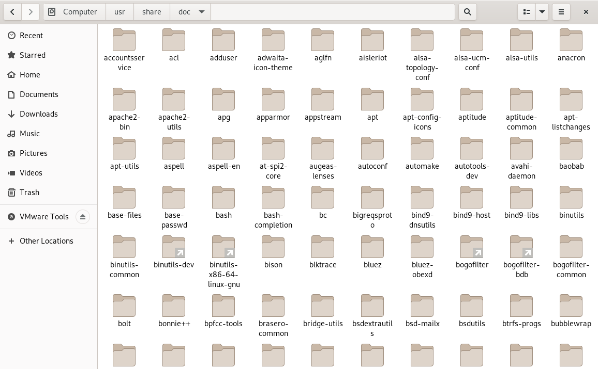

# Linux System Documentation & `man` Pages 

Consulting help documentation is an everyday part of working in Linux, not a sign of inexperience; even seasoned system administrators rely on it constantly. Because Linux systems are assembled from a wide range of open-source software, documentation lives in several different places.

## The Four Pillars of Linux Documentation

Linux distributions gather documentation from various software sources and present it in a consistent format. There are four primary sources of documentation on a standard Linux system:

*   **The `man` pages:** Short for "manual pages," this is the classic and most widely used reference for commands, configuration files, and programming interfaces.
*   **GNU Info:** A more structured, cross-linked documentation system used predominantly by GNU tools.
*   **Command `help` (and `--help`):** Quick, built-in reminders of a command's syntax and options, available right at the terminal prompt.
*   **Other documentation sources:** Distribution-specific guides (like the Ubuntu Documentation or Gentoo Handbook) covering installation and distro-specific features.

---

## Deep Dive: The `man` Pages (The Manual)

The `man` page system dates back to the earliest versions of UNIX in the 1970s. It provides in-depth reference material on programs, utilities, configuration files, and low-level programming interfaces (such as system calls and library routines). 

To retrieve the manual for any command, type `man` followed by the topic:
`$ man ls`

### Navigating the Manual (The Pager)
Because `man` pages contain massive amounts of detail, the output is piped through a terminal "pager" program (usually `less`). This formats the text perfectly for your terminal and allows you to read it one screen at a time.

*   **Scroll:** Use the **Up/Down arrow keys** for line-by-line scrolling, or the **Spacebar** to jump down an entire page.
*   **Search:** Type `/` followed by your search keyword, then press **Enter**. To jump to the next matching word, press **n**.
*   **Quit:** Press **q** to exit the pager and return to your standard terminal prompt.

---

## Searching for Commands (`-f` and `-k`)

Sometimes you know what you want to achieve, but you don't know the exact command name. The `man` utility includes built-in search helpers.

### Exact Match Search (`-f`)
If you want a brief description of a command's purpose, use the `-f` flag (which functions identically to the `whatis` command). It lists available pages that match the name exactly.
`$ man -f sysctl`

### Keyword Search (`-k`)
If you don't know the command name, use the `-k` flag (identical to the `apropos` command). It searches through all page descriptions for a specific keyword, surfacing related tools.
`$ man -k sysctl`

*(Note: The default search order for `man` is defined in `/etc/manpath.config` on Debian/Ubuntu systems, or `/etc/man_db.conf` on Red Hat/Fedora systems).*

---

## The Manual Sections (1-9)

The manual is incredibly vast, so it is organized into numbered sections, from 1 through 9. 

This separation is critical because different components often share the exact same name. For example, there is a C programming function named `socket` and a core Linux concept named `socket`. To ensure you get the right documentation, you place the section number before the command.

*   `$ man 7 socket`: Opens the Linux Programmer's Manual overview for the socket interface.
*   `$ man 2 socket`: Opens the specific kernel system call for creating an endpoint for communication.
*   `$ man -a socket`: The `-a` flag forces the manual to display *every* page matching that name, opening them one after another across all sections.

### Section Breakdown Reference Table

| Section | Contents | Professional Examples |
| :--- | :--- | :--- |
| **1** | Executable programs and shell commands | `ls`, `cp`, `grep` |
| **2** | System calls (functions provided by the kernel) | `open()`, `read()`, `write()` |
| **3** | Library calls (functions in program libraries) | `printf()`, `malloc()` |
| **4** | Special files | Device files found in `/dev`, such as `/dev/null` |
| **5** | File formats and conventions | Configuration files like `/etc/fstab`, file formats like `crontab(5)` |
| **6** | Games | Games and screensavers |
| **7** | Miscellaneous | Conventions, macro packages, standards |
| **8** | System administration commands | Privileged commands used by root, such as `fdisk` and `mount` |
| **9** | Kernel routines | Non-standard internal kernel interfaces *(Note: Section 9 is inconsistently populated across distros)* |

---

## The GNU Info System

The next major source of Linux documentation is the GNU Info system. Designed as a richer, highly structured alternative to standard `man` pages, it is the preferred documentation format for the GNU Project. 

Where a `man` page is essentially one long, scrollable text document, an Info manual is structured like a mini-website or e-book. It is hyperlinked and broken down into distinct pages that you can navigate using menus and cross-references. *(Note: This hyperlinked terminal design actually predates the World Wide Web!)*

### Using `info` from the Command Line
*   **Top-Level Directory:** Run `info` without any arguments to open the master tree of all available topics.
*   **Direct Access:** Type `info` followed by the command name (e.g., `$ info ls`) to jump directly to a specific utility.

### Info Page Structure & Navigation
Each page in the Info system is called a **Node**. Nodes act as the chapters and sections of the manual, arranged in a hierarchical tree structure. To jump between nodes, you look for specific link formats:
*   **Menu Items:** Marked with an asterisk (`*`) at the start of a line.
*   **Cross-References:** Marked by a double colon (`::`).

### GNU Info Navigation Cheat Sheet
Unlike `man` pages (which use the `less` pager), the `info` system uses its own specific, case-sensitive keyboard shortcuts. 

| Key | Navigation Function |
| :--- | :--- |
| **`Tab`** | Move your cursor to the next available link (`*` or `::`). |
| **`Enter`** | Follow the link currently under your cursor. |
| **`n`** | Move to the **N**ext node (at the same hierarchical level). |
| **`p`** | Move to the **P**revious node (at the same hierarchical level). |
| **`u`** | Move **U**p to the parent node. |
| **`l`** | Go back to the **L**ast node you visited (functions like a browser's Back button). |
| **`h`** | Open Info's built-in interactive tutorial. |
| **`q`** | **Q**uit the manual and return to the shell prompt. |

---

## Inline Command Usage (`--help`)

When you do not need a comprehensive manual and just need a quick reminder of a command's syntax, use the `--help` option. 

`$ ls --help`

Unlike `man` and `info`, the `--help` flag prints a concise usage summary directly to standard output (`stdout`) and instantly returns you to the prompt. There is no pager to scroll through or quit, making it the absolute fastest way to jog your memory.

> ⚠️ **The `-h` Trap:** Many beginners mistakenly use the short `-h` flag expecting a help menu. For many core system commands (like `ls`, `df`, and `du`), `-h` actually stands for **"Human-readable"** (converting byte sizes into Megabytes/Gigabytes). Always use the long-form `--help` to guarantee you get the documentation!

---

## Shell Built-ins and the `help` Command

When working in the Bash shell, certain standard commands (like `cd`, `echo`, and `pwd`) are not separate executable binaries located in `/usr/bin`. Instead, they are **Shell Built-ins**. 

Bash runs its own internal versions of these commands because it is faster and requires fewer system resources than launching a separate program. Because they are not standard binaries, you do not use standard `man` pages to look them up. Bash provides a dedicated `help` command specifically for its built-ins.

*   `$ help`: Lists all available Bash built-in commands.
*   `$ help cd`: Shows the specific usage and options for the `cd` built-in.

> 💡 **SysAdmin Pro-Tip (`type`):** If you are ever unsure whether a command is a standalone binary program or a shell built-in, use the `type` command. 
> *   `$ type cd` will output: *cd is a shell builtin*
> *   `$ type ls` will output: *ls is aliased to `ls --color=auto`*

---

## Graphical Help Systems

Beyond the terminal, every major Linux desktop environment (DE) includes a built-in graphical help application. These applications provide guides for the desktop environment itself and can often render `man` and `info` pages in a nicely formatted, clickable graphical interface.

### Launching from the Terminal
Instead of hunting through application menus, you can launch these graphical help browsers directly from the command line:
*   **GNOME:** `$ yelp` (or `$ gnome-help`)
*   **KDE Plasma:** `$ khelpcenter`

### The `F1` Universal Shortcut
Just as in the Windows and macOS ecosystems, pressing the `F1` key while using many Linux desktop applications will instantly open the software's dedicated help page. While support varies by application, it is the fastest way to access GUI-specific documentation.

---

## Local Package Documentation (`/usr/share/doc`)

When you install software via a package manager (`apt`, `dnf`), the system does not just install the executable binary. It also unpacks upstream documentation from the developers and specific release notes from your distribution's maintainers.

You can find these files stored locally in the `/usr/share/doc` directory, organized neatly into subdirectories named after each specific package.

Browsing these folders is a highly recommended SysAdmin practice. It is the best place to discover `README` files, version changelogs, and—most importantly—**sample configuration files** that are not included in the standard `man` pages.

---

## Official Online Resources

When local documentation does not solve the problem, system administrators turn to official online repositories. Because Linux is open-source, the community documentation is incredibly vast.

### Recommended Reading
A universally recommended starting point for mastering the terminal is **"The Linux Command Line"** by William Shotts. It is a free, downloadable book available under a Creative Commons license and is considered required reading for backend engineers.

### Official Distribution Portals
Every major enterprise distribution maintains its own highly detailed documentation, wikis, and community forums. Always check your specific distribution's portal for accurate configuration guides:

*   **Ubuntu:** [help.ubuntu.com](https://help.ubuntu.com/)
*   **Fedora:** [docs.fedoraproject.org](https://docs.fedoraproject.org/en-US/docs/)
*   **CentOS Stream:** [docs.centos.org/centos-stream-docs](https://docs.centos.org/centos-stream-docs/)
*   **openSUSE:** [doc.opensuse.org](https://doc.opensuse.org/)
*   **Gentoo:** [gentoo.org/support/documentation](https://www.gentoo.org/support/documentation/)
